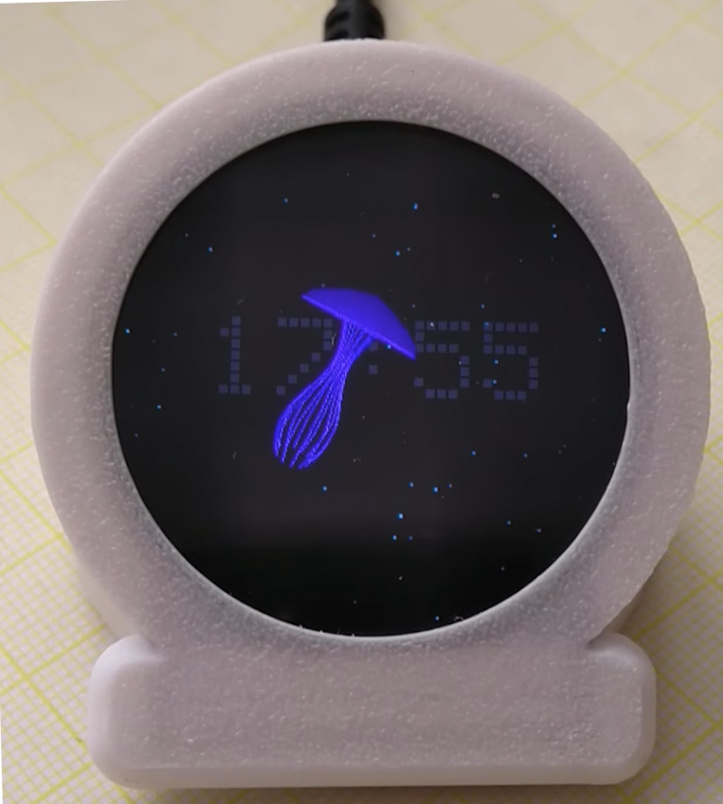

# `Denki Kurage` (ja: 電気くらげ, electric jellyfish)

This is a remix of [Denki Kurage](https://github.com/likeablob/denki-kurage) that is compilable with the Arduino IDE.

<video src="https://github.com/holgerlembke/denkikurageArduino/blob/main/resources/video.mp4" loop muted></video>

To support more display types it uses [Arduino_GFX_Library](https://github.com/moononournation/Arduino_GFX) from moononournation.

## Changes
* a "little" bit reorganization due to IDE compile process
* moved to Arduino_GFX_Library because display is qspi
* removed debug mode
* "scalefactor" for zooming jellyfish bigger/smaller
* "biggerparticles" and "evenbiggerparticles" for particle size
* added a clock (because we all love clocks) 
  Wifi for sync, only connected once a hour

## Case

Keili(https://github.com/holgerlembke/OpenSCAD-Modelle/blob/main/denkikurage.scad)
